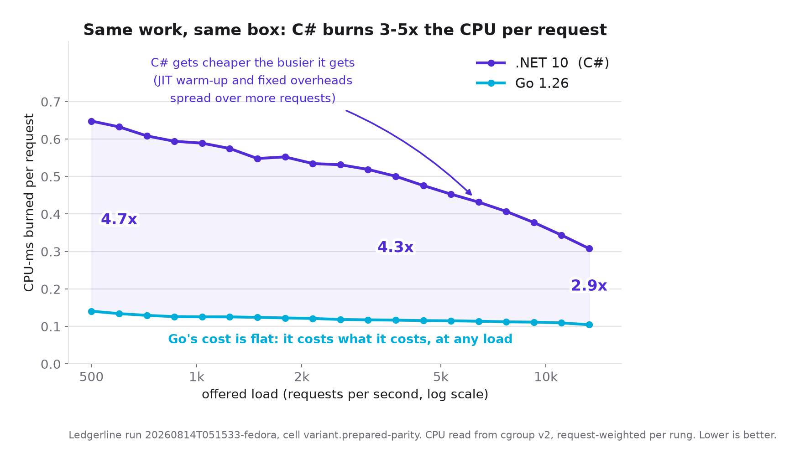

# Ledgerline: Go 1.26 vs .NET 10 on a realistic backend workload

**A reproducible benchmark that asks what a backend service costs to run, not how
many requests it can shout per second.**

> **Status:** one published measured run (August 2026). About two months of
> part-time work went into the two services, the frozen spec they both implement and
> the runner that measures them; the measuring itself was four days. Not under active
> development. Methodology challenges are welcome and get re-run:
> see [Disagreeing productively](#disagreeing-productively).

The same invoicing API, specified once and implemented twice: in Go 1.26
(`net/http`, sqlc and hand-written pgx) and .NET 10 (Minimal API + EF Core). Both hit a
shared PostgreSQL 18.4 and Redis. The measured quantity is **cost at a fixed
latency promise**: CPU-ms and steady-state memory per request at the rate where
mixed-workload p99 crosses 20 ms, read from cgroup v2 rather than from anything
the process says about itself.

The service under test has a codename, **Ledgerline**, the way TechEmpower's test
is called Fortunes. You will see it in container names, package names and the run
artifacts. It is just a label for the invoicing API described below.

Everything in `spec/` (the workload, the SLO, the decision rule, every fairness
dial) was frozen and public *before* any measured number existed, so results
cannot be retrofitted. Every run manifest records a `config_hash` over all of
`spec/`.

### The headline

From run `20260814T051533-fedora`: **358,673,386 requests** across 618 measured
windows and five cells, over four days on one tuned Ryzen 9 7950X (89 hours of
wall-clock, about 65 of them driving load; the run was interrupted once and
resumed).

- .NET held the 20 ms promise to **10,426 req/s**. Go never crossed 20 ms in any
  ladder in the run, so its capacity is a floor, not a measurement.
- At 11,093 req/s, .NET spent **3.09x** Go's CPU-ms per request and **5.33x** its
  in-window anonymous memory.
- Per-request CPU is **not a stack constant**. Across 19 rungs the .NET:Go ratio
  runs 4.72x at 600 req/s and 3.14x at 11,093. Go's cost is flat (CoV 7.4%);
  .NET's falls by more than half as load rises.
- Swapping EF Core for Dapper or hand-written ADO.NET moves the knee by under
  2.5%. Turning on Npgsql's `Max Auto Prepare` moves EF Core's knee **7x**, from
  1,468 to 10,426 req/s. Dapper and raw ADO.NET reach ~10,300 with that same flag
  at its default of off, so the 7x belongs to EF Core's unprepared parameter
  path, not to a default that costs every .NET data layer.



The capacity gap quoted as **at least 1.28x** is 13,312 / 10,426: the highest rate at
which Go still met the 20 ms promise, over .NET's fitted knee. It is a lower bound on
both ends, because 13,312 rps is simply the top rung the ladder offered, not a rate at
which Go failed.

Every figure under [`docs/figures/`](docs/figures/) is drawn by
[`bench/figures.py`](bench/figures.py) directly from `report/fits.json` and
`ledger.json`, using the run's own isotonic fit. `make figures` redraws them; no number
in them is typed by hand.

Full tables: [`results/20260814T051533-fedora/report/report.md`](results/20260814T051533-fedora/report/report.md).
Everything the run does **not** establish is listed there and in
[`results/README.md`](results/README.md); read that before quoting a number.

Narrative write-up: **[I'm a .NET Developer. I Spent Two Months Benchmarking Go vs C#
and I Didn't Like the Answer.](https://dev.to/haikasatryan/im-a-net-developer-i-spent-two-months-benchmarking-go-vs-c-and-i-didnt-like-the-answer-31fm)**

---

## Start here

Which of these are you?

| you want to | go to |
|---|---|
| run it yourself, on any OS, in a few minutes | [Functional tier](#functional-tier-any-os) |
| reproduce the measured numbers | [Measured tier (Linux)](#measured-tier-linux) |
| read the results of the published run | [Reading a run](#reading-a-run) |
| check whether the method is sound | [`docs/METHODOLOGY.md`](docs/METHODOLOGY.md) |
| argue that a dial is unfair | [`docs/FAIRNESS.md`](docs/FAIRNESS.md) |
| hack on the services | [What's in here](#whats-in-here) |

## What the workload actually is

Six endpoints, one frozen request mix:

| share | endpoint | what it exercises |
|---|---|---|
| 30% | `GET /invoices/{id}` | cache-aside through Redis, PostgreSQL on miss |
| 25% | `GET /customers/{id}/invoices?page=N` | paged query, skewed to page 1 |
| 20% | `POST /pricing/quote` | ~8 KB body, 50 items, pure CPU pricing algorithm |
| 15% | `POST /invoices` | ~2 KB body, real multi-statement transaction + cache invalidation |
| 8% | `POST /invoices/{id}/pdf-stub` | deterministic 32 KB buffered write |
| 2% | `GET /healthz` | liveness |

Keys are drawn Zipf-hot (alpha 1.0) from 1M seeded customers and 5M seeded
invoices. The published run replayed a fixed list of 1,000,000 pre-generated
requests touching 137,028 distinct invoices, and measured a Redis hit rate of
**0.807** against the 0.80 the workload was built to target.

Both implementations are idiomatic. No hand-rolled routers, no pre-built byte
arrays, no leaderboard tricks. A cross-service equivalence suite enforces that
they behave identically on the wire; it passed 19/19 before the run started.

### Versions

Everything here is pinned in a committed file, so the table is checkable rather
than remembered. `manifest.json`'s `versions` block is **not** populated by the
runner (it records `source: not_measured`); this is the authoritative list.

| component | version | pinned in |
|---|---|---|
| Go | 1.26.5 | `services/go/go.mod`, `services/go/Dockerfile` (`golang:1.26.5-bookworm`, digest-pinned) |
| pgx | v5.10.0 | `services/go/go.mod` |
| go-redis | v9.22.0 | `services/go/go.mod` |
| sqlc | 1.31.1 | build-time only; generated code under `internal/db/gen/` is committed |
| .NET | 10.0 | `services/dotnet/Ledgerline.csproj` (`net10.0`), SDK + `aspnet:10.0-noble-chiseled` images digest-pinned |
| EF Core | 10.0.11 | `Ledgerline.csproj` (`Microsoft.EntityFrameworkCore.Relational`), `dotnet-tools.json` (`dotnet-ef`) |
| Npgsql | 10.0.3 | `Ledgerline.csproj` (`Npgsql`, `Npgsql.EntityFrameworkCore.PostgreSQL`) |
| Dapper | 2.1.79 | `Ledgerline.csproj` (`variant.dapper` only) |
| StackExchange.Redis | 3.1.13 | `Ledgerline.csproj` |
| PostgreSQL | 18.4 | `infra/compose.yaml` (`postgres:18.4-bookworm`, digest-pinned) |
| Redis | 8.10.0 | `infra/compose.yaml` (`redis:8.10.0-trixie`, digest-pinned) |
| vegeta | v12.13.0 | `infra/vegeta/Dockerfile`, built from source on the locked Go toolchain |

.NET runs plain `dotnet publish -c Release`: tiered JIT with dynamic PGO, **no
ReadyToRun and no Native AOT**. Go runs plain `go build` with no PGO profile.
Both are their stack's documented default; see
[`docs/FAIRNESS.md`](docs/FAIRNESS.md) for why.

## Prerequisites

```sh
git clone <this repo> && cd ledgerline-benchmark
```

- **Docker** with Compose v2. Docker Desktop is fine for the functional tier; the
  measured tiers need rootful Docker with cgroup v2 unified.
- **[uv](https://docs.astral.sh/uv/)** to run the Python benchmark runner.
- **make** for the thin wrappers. On Windows use Git Bash or WSL, or run the
  underlying `uv run ledgerbench …` / `docker compose …` commands directly.
- Go and .NET SDKs are **not** required: the services build inside Docker. You
  only need them to hack on the services themselves.
- For the **measured tier only**: root, or a NOPASSWD `sudo` grant for the
  operator. `make doctor` fails the run without it, because host tuning shells out
  to `sudo -n`.

## Functional tier (any OS)

This proves everything builds, seeds and behaves identically. It **measures
nothing** and is safe to run on a laptop, including Windows.

```sh
cd bench && uv sync && uv run pytest   # pure-logic suites, no Docker needed
make smoke                             # build, seed a tiny dataset,
                                       # run the equivalence suite, fire a short probe
```

If `make smoke` passes, your environment is sound and both services agree with
the spec.

## Measured tier (Linux)

Measured runs are Linux-only and the `make bench-*` / `host-setup` targets are
gated to refuse anywhere else. A full run spans several nights.

```sh
make doctor        # preflight
make seed-full     # seed 1M customers / 5M invoices via the dockerized seeder
make host-setup    # Tier-1 host tuning: READ THE WARNING BELOW FIRST
make bench-all     # capacity gate -> validation -> GC-posture cells -> variants -> soak
make analyze RUN=<run_id>   # knee fits, stats, report tables -> results/<run_id>/report/
make host-restore  # undo everything host-setup changed
```

> **`make host-setup` mutates your machine.** It changes the CPU governor, turns
> boost off, caps C-states, sets THP mode, re-steers IRQs, installs a systemd
> `CPUAffinity` drop-in and sets `chattr +C` / `noatime` on the pgdata directory.
> Every mutation writes its original value to a state file, and **`make host-restore`
> replays that file to undo all of it**. Run it on a box you own and can reboot, not
> on a shared machine. `infra/host-setup.sh` without `--tune` only detects and
> reports, changing nothing.

`make bench-all` runs the two headline cells. The variant cells (`variant.ado`,
`variant.dapper`, `variant.prepared-parity`) are declared but not executed unless
you ask for them, because each is a full ~15 h cell:

```sh
LEDGERBENCH_RUN_VARIANTS=variant.ado,variant.dapper make bench-all
```

Set that and `LEDGERBENCH_TARGET_COUNT` **before** starting a run: both are pinned
into the ledger at run start and the pin wins on resume. `uv run ledgerbench --help`
lists all four operator knobs; [`docs/RUNBOOK.md`](docs/RUNBOOK.md) explains what each
one costs.

`analyze` reports, it does not gate. The runner **aborts** the measured cells on a
non-passing capacity gate, and `analyze` **excludes** under-warmed probes itself
and prints the used/flagged-excluded counts per row. Two things stay manual
before you publish anything: the capacity-gate verdict, and the per-cell flag
counts that decide whether a cell is a measurement or posture.
[`docs/RUNBOOK.md`](docs/RUNBOOK.md#full-run-sequence) lists exactly which files
to read.

### Interruptions

The run is resumable at probe granularity. After any interruption:

```sh
make bench-status   # where it stopped: phase states, per-cell progress, next pending item
make bench-resume   # resume the most recent unfinished run
```

Host re-tuning and DB invariant checks happen automatically on resume, finished
probes never re-run, and an interleave block split by a crash is redone whole so
the pairing stays honest.

### Reproducibility tiers

- **Tier 1 (exact).** The published numbers come from one machine: Ryzen 9 7950X,
  two 8-core CCDs, Fedora 43, NVMe, with `infra/host-setup.sh --tune` applied.
  Reproducing them exactly needs that class of setup.
- **Tier 2 (directional).** A Linux box with cgroup v2 and enough hardware can run
  the same procedure; `--tune` detects and skips what it cannot apply. The real
  floor is set by `infra/compose.bench.yaml`, which pins cpusets and memory: 6 cores
  and 12 GB for each SUT, 3 cores and 8 GB for PostgreSQL, 3 cores and 4 GB for the
  load generator, 1 core and 2 GB for Redis, plus a core for the runner. That is
  **15+ physical cores and about 26 GB** on the default layout. Every cpuset and
  limit is env-parameterized, so a smaller box means editing those knobs and
  accepting that you changed the experiment. Expect the ratios to hold
  directionally, not the absolute numbers; the knobs are documented in
  [`docs/RUNBOOK.md`](docs/RUNBOOK.md).
- **Functional (any OS).** `make smoke`. Proves behaviour, measures nothing.

## Reading a run

A finished run lives in `results/<run_id>/`:

| file | what it answers |
|---|---|
| `report/report.md` | **start here.** Knee fits, p99 vs the SLO, CPU-vs-rate, resource roll-ups, and an explicit "not captured" section |
| `report/fits.json` | the same numbers as data, if you want to plot or re-analyse them |
| `manifest.json` | provenance: versions, knobs, capacity gate, config hash, achieved-vs-offered per probe |
| `ledger.json` | crash-safe run state; per-probe p99, warm/flagged status, exclusions |
| `capacity-gate/verdict.json` | proof the database was not the bottleneck |
| `cells/<cell>/<stage>/rate<N>/block<M>/` | the raw evidence: per-probe vegeta summaries, warm-up gate records, cgroup CPU/memory deltas |
| `CHECKSUMS.committed.sha256` | sha256 over exactly what git tracks in the run: `sha256sum -c` it |
| `CHECKSUMS.run.sha256` | the runner's own append-only log, kept as run evidence; see [`results/README.md`](results/README.md) for why it is not the file to verify against |

Three habits will keep you out of trouble:

1. **Read the used/flagged-excluded counts next to any figure.** The published
   run's warm-up gates flagged 368 of 618 windows (59.5%), asymmetrically (Go
   67.3%, .NET 51.8%). Several Go roll-ups rest on one or two warm windows.
2. **Rows marked `*` are posture, not measurement.** They come from windows that
   failed a gate and are shown for direction only.
3. **A knee is an ordering, not a precision instrument.** The bracketed intervals
   are spread indicators over as few as one or two reps, not inferential CIs.

## What's in here

| path | what |
|---|---|
| `spec/` | the single source of truth both services implement: DDL, OpenAPI, workload, SLO + knee/warm-up numerics, frozen pricing algorithm, logging + DB-access + cache contracts, PostgreSQL config |
| `services/go` | Go 1.26: `net/http` ServeMux, sqlc + pgxpool, slog + bounded async writer. sqlc generates the list and existence queries; the batched point read and the create transaction are hand-written pgx, because pgx cannot propagate `RETURNING` between batched statements (see [FAIRNESS](docs/FAIRNESS.md)) |
| `services/dotnet` | .NET 10: Minimal API, EF Core 10 + Npgsql, raw-ADO.NET and Dapper variants behind `DATA_LAYER`, MEL JSON console |
| `seed/` | deterministic seeder (seed 42): 1M customers / 5M invoices, binary COPY, invariant checks |
| `infra/` | Compose (portable base + Linux resource overlay), the vegeta image, host tuning scripts |
| `bench/` | Python runner (ladder → fit → confirm → soak, resumable), the cross-language equivalence suite, and analysis (isotonic knee fit, Mann-Kendall, paired-difference CI) |
| `results/` | committed per-run manifests and text artifacts; see [`results/README.md`](results/README.md) for what is and is not published |
| `docs/` | [METHODOLOGY.md](docs/METHODOLOGY.md) (how every number is produced), [FAIRNESS.md](docs/FAIRNESS.md) (every dial, both sides, and why), [RUNBOOK.md](docs/RUNBOOK.md) (operating a measured run), [figures/](docs/figures/) (charts drawn from the committed artifacts by `bench/figures.py`) |

Each of `bench/`, `infra/`, `seed/` and both services carries a `NOTES.md`
recording the judgment calls made where `spec/` left a degree of freedom. If you
want to know *why* something is the way it is, that is where to look.

## Fairness, in one paragraph

Both services implement `spec/` exactly, enforced by golden and cross-service
equivalence tests. Pool sizes are pinned identical (24/24, manifest-asserted and
verified warm in every cell); core parallelism is pinned and asserted on both
sides; both drivers run the extended protocol with binary formats;
prepared-statement defaults differ by design (pgx caches, Npgsql does not), which
is disclosed and **priced by a dedicated variant** rather than quietly fixed on
either side; GC posture is a measured axis, not a hidden default; logging is
contractually identical; every probe runs the published multi-gate warm-up, its
verdict is recorded per probe, and `analyze` excludes the flagged probes and
prints the counts. The database runs in its own cgroup, and the capacity gate measured PostgreSQL
tracking every rung to 3,715 req/s of create-only load on its 3 cores without
breaking, so the headline measures the language stacks. The gate's headroom test
ran against a pre-registered planning estimate rather than the rates the cells
chose, which is recorded as a known limit below.
The full list, including the asymmetries that count against each side, is in
[`docs/FAIRNESS.md`](docs/FAIRNESS.md).

## Known limits

The long form is in [`results/README.md`](results/README.md) and
`docs/METHODOLOGY.md`. The short form:

- **No Go knee.** Go never crossed the SLO inside any measured ladder, so every Go
  capacity number is a lower bound and the capacity gap (at least 1.28x) has no
  measured upper end.
- **Warm-window thinness is the run's biggest data-quality cost** (59.5% of
  windows flagged, Go harder than .NET).
- **The knee intervals are spread indicators, not inferential CIs.**
- **The paired p99 verdicts are direction and effect size only** (n = 2 and 3,
  both intervals span zero).
- **The `gc-generous` cell is posture, not measurement.** Every Go window
  failed a warm-up gate (39/39, against 26/39 on the .NET side), so no interleave
  block survives on both sides. Its one usable observation is directional:
  told memory was free, Go held 6.6 GB of anonymous memory against .NET's 212 MB.
- **Several columns were removed from scope rather than left as promises:**
  DB-CPU-per-request attribution, per-window GC counters, descending-ladder
  hysteresis, p999 order-statistic CIs.
- **The capacity gate's headroom test used a pre-run projection.** It compared
  PostgreSQL's measured 3,715 create-only rps against 2,160 rps of demand computed
  before the ladder ran. The cells then operated at 9,244 to 13,312 rps, implying
  roughly 5,000 to 7,200 rps of mixed DB load. PostgreSQL was never observed to
  break, but it was not tested at the cells' realized rates.
- **The run was interrupted for about 20.7 hours** during the `prepared-parity`
  ladder and resumed under the documented protocol; ~65 of the 89 wall-clock hours
  were spent driving load. Details in [`results/README.md`](results/README.md).
- **The ADO and Dapper cells are not a pure no-ORM floor.** .NET's `/readyz`
  resolves `LedgerDbContext`, so the EF model is built and pooled in every cell.
  `/readyz` is outside the workload mix, so it costs no measured request, but those
  two cells are "no ORM on the hot path", not "no EF in the process".
- **22 more probes were dropped by the error-rate and rate-fidelity gates**, on
  top of the warm-up flagging: 9 on the Go side, 13 on the .NET side. The full list
  with reasons is in [`results/README.md`](results/README.md).
- **The manifest does not evidence host tuning or versions.** `versions`,
  `host_state`, `topology` and `postgres_config` record `source: not_measured`;
  tuning is documented by the procedure and versions by the table above, neither
  read back off the box.
- **One box, one workload, one topology.**

## Disagreeing productively

Think a dial is unfair? Read [`docs/FAIRNESS.md`](docs/FAIRNESS.md), then open a
[methodology concern](.github/ISSUE_TEMPLATE/methodology-concern.md).
[`CONTRIBUTING.md`](CONTRIBUTING.md) describes what makes a report answerable.
Claims that come with a reproducible probe get taken seriously and re-run.

## Licence

This repository is [MIT](LICENSE): the spec, both service implementations, the
runner, the analysis and the committed run artifacts. Quote the numbers, re-run the
procedure, disagree with it in public.

One dependency is not MIT: the benchmark runs **Redis 8, which is AGPL-licensed**.
It is a pinned container image, not linked code, so it does not affect this
repository's licence, but Valkey is a documented drop-in if it matters for your
environment.
